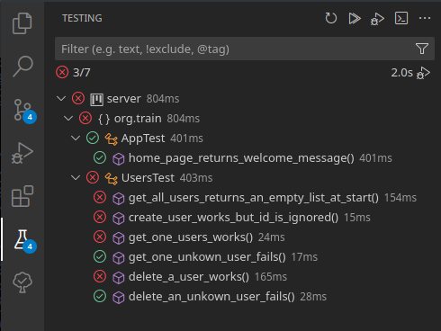

# Javalin crash course
A pretty small crash course on [Javalin](https://javalin.io/), a simple Java web framework, just to get started with important concepts to develop a web application. This is not guided on the details, but you have integration tests to verify the correctness of the implemented behaviours.

You are going to create a simple comments system called `Comment?` (this is a French joke, don't lose time understanding it).

## Goals
In this small experimentation course, the main goal is to help you getting started and be productive with Javalin, not by reading the full documentation but training on developing simple features to let you build a basic mental model on how Javalin works and you can structure your application with the MVC design pattern. <!-- really a design pattern btw ? -->

**What exactly are you going to practice ?**
1. Creating routes for all CRUD operations
1. Creating controllers and use to understand a simple convention related to CRUD methods naming
1. The MVC design pattern. Important to understand the roles of each class type.
1. Managing responses content, status codes, fake database with in memory Hashmap, using headers and body of the requests, defining them in the response.
1. The creation of views with a simple templating system (yet to choose one, Javalin doesn't support one by default). We will use it to have dynamic welcome page.
1. Set up a basic authentication system, to discover some middlewares mechanisms
1. Writing some integration tests allowing to easily verify that everything works well and continues to work after refactorings and changes.

**Data model**
We have only 2 entities: users and comments. I already prepared a model `Comment.java` inside `models` as this is not very interesting to do:
<!-- TODO: commit the model Comment! -->
```json
[
	{
		"id": 3,
		"content": "Hello there, I really like the sunshine today",
		"date": "2023-12-20",
		"author_id": 1
	},
	{
		"id": 5,
		"content": "It's seems to be cloudy today.",
		"date": "2023-12-30",
		"author_id": 2
	},
	{
		"id": 12,
		"content": "Let's talk about weather specialist that are ALWAYS wrong. New Year's Eve dinner without any snow !",
		"date": "2023-12-31",
		"author_id": 6
	},
	{
		"id": 21,
		"content": "Already feeling the vibe of 2025.",
		"date": "2024-12-03",
		"author_id": 1
	}
]
```

Then an example of users. I prepared a model `User.java` inside `models` too.
```json
[
	{
		"id": 3,
		"username": "Michele",
		"password": "Michele",
	},
	{
		"id": 5,
		"username": "John",
		"password": "John",
	},
	{
		"id": 10,
		"username": "Carla",
		"password": "Carla",
	}
]
```
As you noticed passwords are not hashed, this is very bad in terms of security, but you will implement this later.

## Solution
At the end, I will provide my humble solution in case you are really stuck, or you want to compare. I will push it in a separate branch.

## Setup
Here are some advices on the environment and IDE setup.

I really recommand you to read this document online on GitHub, not in your local or forked version, to access the latest version because this is in a very changing phases.

Recommended VSCode setup:
1. Install the Java Test Runner extension
1. Use this keyboard shortcut configuration (Commande Palette -> Keyboard shortcuts (JSON)) (put this inside some square brackets `[]` if your file is empty):
	```json
	{
		"key": "ctrl+e",
		"when": "editorLangId == java",
		"command": "runCommands",
		"args": {
			"commands": [
				{
					"command": "workbench.view.testing.focus"
				},
				{
					"command": "workbench.action.focusActiveEditorGroup"
				},
				{
					"command": "testing.clearTestResults"
				},
				{
					"command": "testing.runAll",
				}
			]
		}
	},
	```
	Now when you open a java file and press Ctrl+e, it will run all tests and focus on the testing panel.
	

<!-- ### Dependencies
To download Maven dependencies run these commands:
```bash
mvn package
```

TODO: document this
- download dependencies
- setup ide to run tests -->

## Repos structure
<!-- TODO: update this at the end -->
The files related to our Javalin app, part of them are not provided and must be created.
```
pom.xml
── src
    ├── main
    │   └── java
    │       └── org
    │           └── train
    │               ├── controllers
    │               │   └── UsersController.java
    │               ├── Main.java
    │               └── models
    │                   └── User.java
    └── test
        └── java
            └── org
                └── train
                    ├── AppTest.java
                    └── UsersTest.java
```

## Steps
There is no authentication and login system, there is no permission system, everyone can do any action on all items. Your goal is to implement the basic CRUD (Create Read Update Delete) operations on comments and users, and on top of that a few sort and filter system on comments to discover more parts of the Javalin framework. The route are defined in the tests and documented here so you learn to read and understand those tests !

TODO: refactor some tests to improve readability
TODO: add comments on tests to make them easier to read
TODO: develop comments system
TODO: develop comments filtering
TODO: improve explanations and steps details
TODO: finish and explain Bruno routes ?? really useful ? 

**To make these tests fully pass, here are the various steps to follow in order. If you are stuck, don't forget to come back in the info because you have hints or advices on how to handle errors or some details.**

- [ ] Setup the `Main` class to have a working Javalin server on the given port, returns the welcome message. 
  1. You have to setup the server by uncommenting some lines in `Main` and completing when incomplete. Help yourself with the slides or the [Javalin documentation](https://javalin.io/documentation#getting-started).
  1. You have to setup the server by uncommenting some lines in `Main`
  - [ ] Then build and run the app with this command:
	```bash
	mvn package -DskipTests -Dmaven.test.skip=true -T 8 && java -jar target/server-*.jar
	```

	This kind of output on the server start is expected:
	```
	22:53:43.119 [main] INFO  io.javalin.Javalin - Starting Javalin ...
	22:53:43.269 [main] INFO  org.eclipse.jetty.server.Server - jetty-11.0.17; built: 2023-10-09T18:39:14.424Z; git: 48e7716b9462bebea6732b885dbebb4300787a5c; jvm 21.0.1+12
	22:53:43.344 [main] INFO  o.e.j.s.s.DefaultSessionIdManager - Session workerName=node0
	22:53:43.356 [main] INFO  o.e.j.server.handler.ContextHandler - Started i.j.j.@72035809{/,null,AVAILABLE}
	22:53:43.374 [main] INFO  o.e.jetty.server.AbstractConnector - Started ServerConnector@66d18979{HTTP/1.1, (http/1.1)}{0.0.0.0:7000}
	22:53:43.395 [main] INFO  org.eclipse.jetty.server.Server - Started Server@57250572{STARTING}[11.0.17,sto=0] @643ms
	22:53:43.395 [main] INFO  io.javalin.Javalin - 
		__                  ___          ______
		/ /___ __   ______ _/ (_)___     / ____/
	__  / / __ `/ | / / __ `/ / / __ \   /___ \
	/ /_/ / /_/ /| |/ / /_/ / / / / / /  ____/ /
	\____/\__,_/ |___/\__,_/_/_/_/ /_/  /_____/

		https://javalin.io/documentation

	22:53:43.395 [main] INFO  io.javalin.Javalin - Your JDK supports Loom. Javalin will prefer Virtual Threads by default. Disable with `ConcurrencyUtil.useLoom = false`.
	22:53:43.401 [main] INFO  io.javalin.Javalin - Listening on http://localhost:7000/
	22:53:43.414 [main] INFO  io.javalin.Javalin - You are running Javalin 5.6.3 (released October 15, 2023).
	22:53:43.417 [main] INFO  io.javalin.Javalin - Javalin started in 299ms \o/
	Javalin crash course
	```
	As the `/` The first test `home_page_returns_welcome_message` should also pass !

- [ ] Implement everything required to make tests in `UsersTest.java`.
   1. Routes definition will be in `Main` but your logic related to users must be in a controller file like `UsersController.java`, you can create a subfolder `controllers` for them to not mix them with other classes.
   <!-- 1. Make sure the attributes you want to be in the JSON content are public ! And that there is a default constructor, or you will get parsing errors from Jackson. -->
   1. For each action, create a new route with the correct HTTP verb, create a new method in your controller and develop it until the test pass.
   1. To simulate a db, you can store your users into a `ConcurrentHashMap` with integer keys and User values
   1. To return the elements of the hashmap not the indexed content, use the `.elements()`
   1. Use exception `NotFoundResponse` instead of just a 404 status
- [ ] Implement everything required to make tests in `CommentsTest.java`.
   1. NO TESTS FOR NOW sorry...
   1. Same rules and idea that for users.
- [ ] Implementing passwords hashing and hiding
   1. NO TESTS FOR NOW sorry...
- [ ] Implementing an authentication system
   1. NO TESTS FOR NOW sorry...

## Contribution
If you would like to improve this project, improve some explanations, add tests and their features, you are welcome ! Just try to send small PRs with a single goal, so it's easier to review and discuss changes.

## License

Javalin crash course, by Samuel Roland is a free software released under the [AGPL-3.0-or-later](LICENSE).
